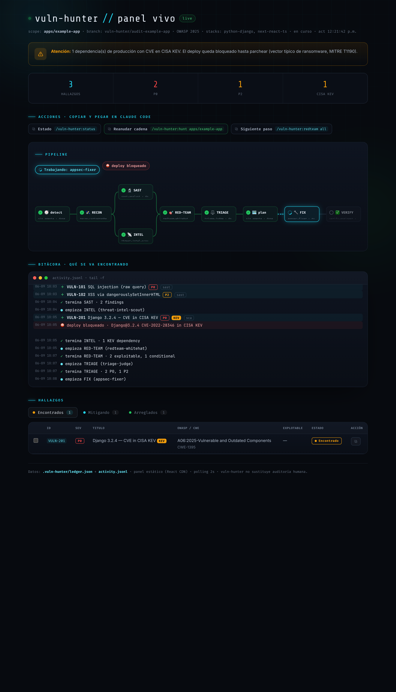

# vuln-hunter 🛡️ (v1.1)

Kit **multi-agente** de Claude Code para **detectar, vigilar amenazas, triar,
planificar, arreglar, parchear y verificar** vulnerabilidades en un proyecto o
monorepo. Alineado a **OWASP Top 10 (2021 y 2025)**. Cada subagente está modelado
como un profesional de seguridad real.

> **Marco de uso:** auditoría **defensiva y autorizada** del código propio, para
> **remediar**. El red-team produce solo PoCs *conceptuales*; el threat-intel solo
> *lee* fuentes oficiales; el patcher nunca commitea sin aprobación humana **del
> diff exacto**. Lo refuerzan hooks deterministas, no solo los prompts.

## Los 7 agentes

| Agente | Rol / persona | Metodología |
|---|---|---|
| `recon-cartographer` | Cartógrafo de superficie de ataque | PTES, STRIDE, PASTA, attack trees |
| `sast-analyst` | Análisis estático (**código propio**) | Taint/data-flow, Semgrep/Bandit/Roslyn, SARIF |
| `threat-intel-scout` | CTI / vuln-management (**dependencias**) | OSV/NVD/KEV/EPSS, SSVC, MITRE ATT&CK T1190 |
| `redteam-whitehat` | Pentester ético (OSCP/OSWE) | PTES, WSTG — **PoC conceptual** |
| `triage-judge` | Analista de triage | CVSS v4.0/v3.1, EPSS, CISA KEV |
| `appsec-fixer` | Security architect / AppSec | OWASP ASVS v5.0.0 — fix de causa raíz |
| `verify-engineer` | Verificación / detección | Re-escaneo + tests, verificación honesta |

## Comandos

| Comando | Qué hace |
|---|---|
| `/vuln-hunter:hunt [path] [--dry-run] [--solo-deteccion]` | Orquesta el flujo completo (auto-detecta y reanuda un run previo) |
| `/vuln-hunter:resume [path]` | **Reanuda** desde donde quedó el run anterior (migra el ledger, retrocompatible, y continúa la cadena sin repetir etapas) |
| `/vuln-hunter:detect [path]` | Detecta stacks del monorepo (scoping) |
| `/vuln-hunter:scan [path]` | SAST de código (delega en sast-analyst) |
| `/vuln-hunter:rescan <path>` | **Re-escanea** SAST un subárbol y fusiona con el ledger; marca como candidato-resuelto lo que ya no aparece |
| `/vuln-hunter:watch [lockfile] [--gate]` | **Threat intel de dependencias de producción** (OSV/NVD/KEV/EPSS) |
| `/vuln-hunter:redteam [VULN\|all]` | Confirma explotabilidad (conceptual) |
| `/vuln-hunter:triage` | Prioriza (CVSS+EPSS+KEV) |
| `/vuln-hunter:plan` | Plan de remediación (superpowers si está, si no propio) |
| `/vuln-hunter:fix [VULN\|all]` | Aplica fixes (sin commit) |
| `/vuln-hunter:patch` | Diffs + aprobación humana por hash + commit |
| `/vuln-hunter:verify [VULN\|all]` | Verifica cierre sin regresión |
| `/vuln-hunter:report [salida.html]` | Informe HTML reproducible desde el ledger |
| `/vuln-hunter:status` | **Dashboard**: progreso del flujo, hallazgos y siguiente comando |
| `/vuln-hunter:panel [puerto]` | **Panel vivo** (React+CDN, estático): lee `.vuln-hunter/ledger.json` + `activity.jsonl` y se actualiza por polling cada 2s para ver hallazgos y su mitigación en tiempo real |

## Flujo

```
recon → [ scan (SAST código) ∥ watch (SCA dependencias) ] → red-team
      → triage → PLAN → fix → patch (aprobación por hash) → verify → report
```

## Estado compartido: el ledger
Todos los agentes leen/escriben `.vuln-hunter/ledger.json` (esquema en
`schemas/ledger.schema.json`). Nadie se pasa prosa: cada agente enriquece su parte
del mismo objeto. Esto unifica severidad, deduplicación y el informe final.

## Prevención de ransomware (lo nuevo)
`threat-intel-scout` cruza tus dependencias de **producción** con fuentes
oficiales y marca como **bloqueantes de deploy** los CVE en **CISA KEV** o con
**EPSS alto** — el vector inicial típico de ransomware (MITRE ATT&CK **T1190**).
`scripts/deploy-gate.py` deriva `.vuln-hunter/deploy-blocked` del ledger y el hook
**bloquea los comandos de deploy que pasen por Claude** hasta parchear (un deploy
lanzado fuera del plugin queda fuera de su alcance). Úsalo así:
```
/vuln-hunter:watch --gate          # veredicto APTO / BLOQUEADO
```

## Instalación
```bash
/plugin marketplace add JoseAFlores777/vuln-hunter
/plugin install vuln-hunter@vuln-hunter-marketplace
```
El marketplace sigue la rama `main`, así que **instalas siempre la última versión**.

**superpowers es OPCIONAL** (mejora el planning). Si lo quieres:
```bash
/plugin marketplace add obra/superpowers-marketplace
/plugin install superpowers@superpowers-marketplace
```

### Actualizar a la última versión
Claude Code no auto-actualiza en silencio; trae lo último de `main` cuando refrescas:
```bash
/plugin marketplace update vuln-hunter-marketplace
/plugin update vuln-hunter
```

## Versionado y releases (mantenedor)
La versión vive en un solo lugar lógico y se mantiene sincronizada en los tres
campos que Claude Code lee (`plugin.json:version`, `marketplace.json:metadata.version`
y `marketplace.json:plugins[].version`) con `scripts/bump-version.py`.

**Releasea SIEMPRE con `scripts/release.sh` — NO tagues a mano.** El CI ya no
escribe en `main`: el tag debe traer los manifests ya en la versión correcta, así
que un `git tag` manual (sin sincronizar) **falla el release**.

```bash
scripts/release.sh 2.1.0
```
El script (lo corres tú en tu terminal): sincroniza `2.1.0` en los manifests,
**commitea** ese sync a `main`, hace **push de main** y crea+empuja el tag `v2.1.0`
sobre ese commit. Así el tag = lo testeado = lo publicado.

El workflow `Release` (`.github/workflows/release.yml`) entonces, **sin tocar main**:
1. Hace checkout del **tag**, valida que sea ancestro de `main` (provenance).
2. Comprueba que los manifests del tag estén en la versión del tag
   (`bump-version.py --check`); si tagueaste a mano, aquí **falla** y te dice que uses
   `release.sh`.
3. Corre la suite de tests sobre el árbol del tag.
4. Publica el **GitHub Release** con notas autogeneradas.

Si te equivocaste y empujaste un tag a mano: bórralo
(`git push origin :refs/tags/vX.Y.Z && git tag -d vX.Y.Z`) y vuelve a usar
`scripts/release.sh X.Y.Z`. `CI` (`.github/workflows/ci.yml`) valida en cada push/PR
que los tres campos de versión no se desincronicen.

## Validar que NO es teatro de seguridad
Incluye un laboratorio con **9 vulnerabilidades plantadas** y su ground truth en
`examples/vulnerable-lab/`. Corre el flujo en `--dry-run` y compara:
```
/vuln-hunter:detect examples/vulnerable-lab
/vuln-hunter:hunt examples/vulnerable-lab --dry-run
```
Cuenta verdaderos positivos (de 9), falsos negativos y falsos positivos (hay un
control negativo que NO debe marcarse). Ese número te dice si el plugin sirve.

## Aprobar un patch (gesto humano, OPCIONAL)
```bash
git add <archivos del fix>                       # stagea EXACTO lo revisado
git diff --cached HEAD                            # revisa el indice staged
python3 scripts/approve-diff.py                   # aprueba ESE indice (por hash)
# si re-stageas/editas, la aprobación caduca: re-aprueba
```
Este gate es **advisory, no bloqueante**: si commiteas sin aprobar (o con el
índice cambiado tras aprobar), `guard-commit-and-exec.py` imprime una advertencia
por stderr pero deja pasar el commit igual. Úsalo como recordatorio de revisión,
no como enforcement automático.

## Salvaguardas (hooks) — defensa en profundidad, NO garantías
**Honestidad ante todo:** la barrera PRIMARIA es la **revisión humana del diff** y
el **allowlist `tools:`** de cada agente. Los hooks son **defensa en profundidad**
y, al inspeccionar cadenas de comandos shell, son **best-effort y evadibles** (un
comando suficientemente ofuscado puede esquivarlos; además un hook PreToolUse solo
ve lo que ejecuta Claude, no algo lanzado fuera del plugin). No los trates como
una garantía absoluta.
- `guard-commit-and-exec.py` — el gate de aprobación por **índice staged** (`git
  diff --cached HEAD`) es **advisory**: detecta wrappers obvios (`bash -c`, `eval`,
  `git -C/-c`, `commit -a`) y avisa por stderr, pero nunca bloquea el commit. Sí
  sigue bloqueando (exit 2) la ejecución ofensiva (shells reversos, etc.) y el
  gate de despliegue con CVE en KEV.
- `block-exploit-write.py` — bloquea contenido de exploit ejecutable; advierte ante
  nombres sospechosos. Fail-closed ante entrada ilegible.
- `guard-webfetch.py` — acota WebFetch del `threat-intel-scout` a fuentes oficiales
  (https + allowlist de hosts); no afecta el WebFetch del resto de la sesión.

## Estructura
```
vuln-hunter/
├── .claude-plugin/{plugin.json, marketplace.json}
├── agents/        (7 subagentes)
├── commands/      (15 slash commands)
├── skills/        (stack-detector, owasp-reference, ledger-contract, ...)
├── hooks/         (hooks.json + 3 guardianes: commit/exec/deploy, exploit-write, webfetch)
├── scripts/       (run-scan.sh, intel-cache.sh, approve-diff.py, deploy-gate.py,
│                   report.py, ledger.py, status.py, activity.py, build-panel.sh, ...)
├── panel/         (index.html compilado + app.jsx fuente)
├── schemas/       (ledger.schema.json)
├── examples/      (vulnerable-lab con ground truth)
├── docs/          (landing + informes de auditoría)
├── CLAUDE.md      (reglas persistentes)  ·  SECURITY.md  (aislamiento + reporte)
└── README.md
```

## Aislamiento (importante)
Auditar un repo ejecuta tooling de ese repo (tests, config/plugins de eslint,
scripts de install) → puede correr su código. Si **no confías** en el repo,
córrelo dentro de un contenedor/VM aislada, sin secretos ni red interna. Ver
[`SECURITY.md`](SECURITY.md).

## Para qué sirve — y qué no reemplaza
vuln-hunter te ayuda a **identificar, priorizar y mitigar** vulnerabilidades
temprano (shift-left): un primer pase **disciplinado, reproducible y con
trazabilidad** que enfoca dónde mirar y acelera la remediación.

No es recomendable usarlo como **única** medida de seguridad. **No sustituye**:
- una **auditoría humana independiente** ni un **pentest profesional**;
- herramientas **SAST/DAST dedicadas** (o comerciales) corriendo en tu pipeline;
- procesos de **revisión de código** y gestión de vulnerabilidades formales.

Y recuerda: los **hooks son defensa en profundidad evadible**, no garantías; la
barrera primaria es la **revisión humana** del cambio. Úsalo como **complemento**
que acelera y enfoca el trabajo, mide su acierto con el laboratorio
(`examples/vulnerable-lab`), y combínalo siempre con medidas más estrictas antes
de confiar en producción. Licencia MIT.

## Visualizacion y guia paso a paso (v1.2)
Cada agente presenta su resultado con un formato uniforme (skill
`agent-presentation`): cabecera con icono, resumen de 3 lineas, tabla de
hallazgos con emoji-semaforo de severidad (🔴P0 🟠P1 🟡P2 🟢P3 ⚪filtrado), barra
de progreso del flujo, y un bloque **"▶ Siguiente paso"** que recomienda el
comando exacto a ejecutar.

En cualquier momento, `/vuln-hunter:status` muestra un **dashboard determinista**
(generado por `scripts/status.py` desde el ledger, sin depender del LLM) con
donde estas en el flujo, los hallazgos por severidad, la alerta de KEV y el
siguiente comando recomendado. Las decisiones se piden con preguntas unicas y
enumeradas (una a la vez), o con botones si el entorno los soporta.

Para verlo en vivo, `/vuln-hunter:panel` levanta un frontend estatico (JSX
pre-compilado, sin build en el navegador) servido **solo en 127.0.0.1**. La verdad
de estado es el ledger; `activity.jsonl` (append-only, escrito por
`scripts/activity.py`) es el timeline. El panel hace polling cada 2s mientras corre
la auditoria. Ver `docs/adr/0001-panel-liveness-architecture.md`.

**Historial de corridas.** Al generar el informe, `scripts/archive-run.py`
snapshotea la corrida (ledger + activity + informe + resumen) a
`.vuln-hunter/history/<id>/` y actualiza `history/index.json`. El panel trae un
**selector de corridas**: "En vivo" (la actual, con polling) o cualquier auditoria
pasada en modo solo-lectura. El historial es **local** (`.vuln-hunter/` esta en
.gitignore): persiste en tu maquina pero no se commitea, asi los detalles de
hallazgos no se publican en git.



El grafo de pipeline (estilo GitHub Actions) muestra que agente trabaja, con el
fork paralelo `scan`/`watch`; la bitacora es el timeline de lo que se va
encontrando; las pestanias **Encontrados / Mitigando / Arreglados** mueven cada
hallazgo segun avanza. Para reanudar un run anterior usa `/vuln-hunter:resume`
(retrocompatible: migra el ledger sin perder estado) y para re-escanear un
subarbol `/vuln-hunter:rescan <path>`.
